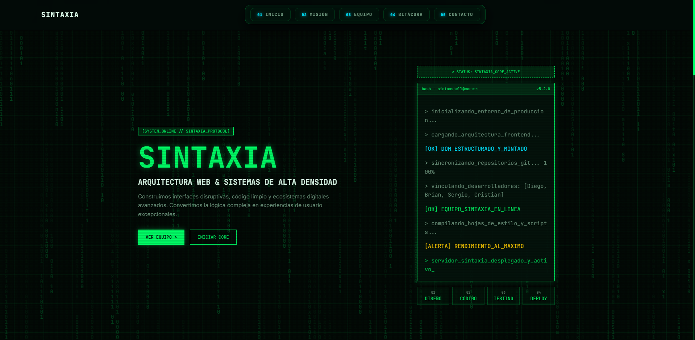
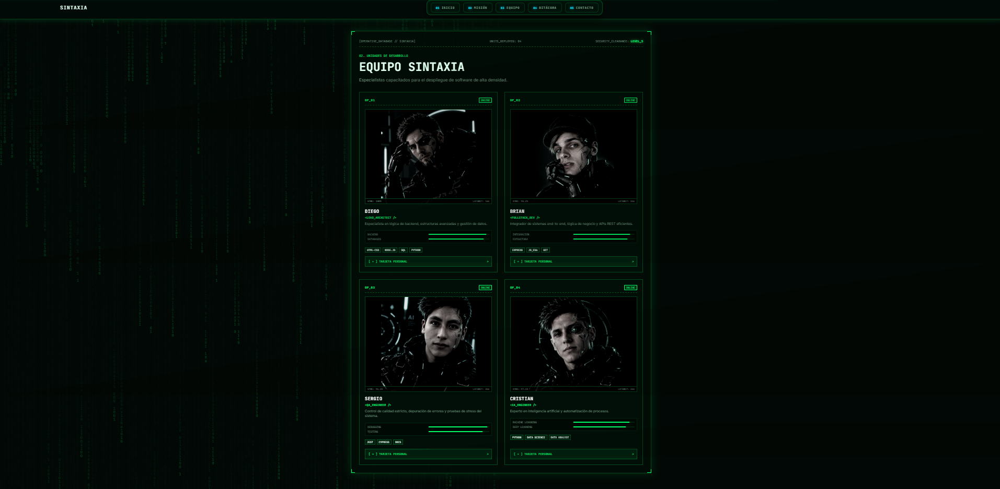
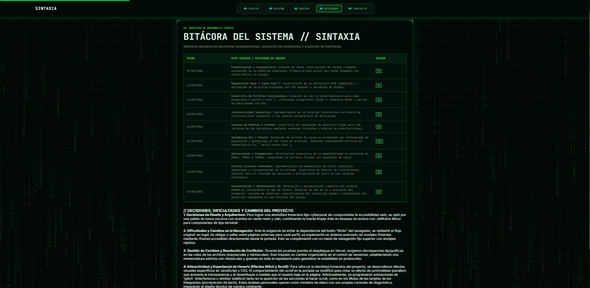
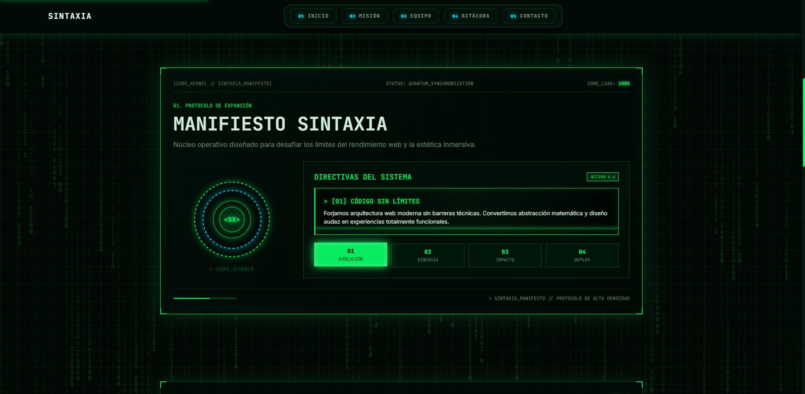

# 🧬 SINTAXIA

Plataforma web de alta densidad visual e interfaces inmersivas, desarrollada como trabajo práctico para la materia **Desarrollo de Sistemas Web Front-End** del **IFTS N.º 29**.

El proyecto emula un sistema operativo futurista mediante **HTML, CSS y JavaScript interactivo**, combinando animaciones, efectos visuales, terminales, Canvas e interfaces inspiradas en sistemas HUD.

---

## 🔗 Enlaces del Proyecto

### 🚀 Despliegue en Producción

https://tp-1-self.vercel.app/

### 📦 Repositorio del Grupo

https://github.com/GRUPO-31/TP1

---

## 👥 Integrantes del Equipo

### Diego Rodriguez

GitHub: https://github.com/diegojrodriguez

### Brian

GitHub: https://github.com/brianlavandera3

### Sergio Vargas

GitHub: https://github.com/SergioVargas101

### Cristian Villagra

GitHub: https://github.com/Crrisst

---

## 🛠️ Tecnologías Utilizadas

* **HTML5 Semántico:** estructuración del contenido, modales y accesibilidad.
* **CSS3 Modular:** variables nativas, Flexbox/Grid, animaciones mediante `@keyframes` y diseño responsive.
* **JavaScript ES6+:** manipulación del DOM, lógica de terminales, Canvas API y `Intersection Observer`.
* **Vercel:** despliegue y alojamiento del proyecto en la nube.

---

## 📂 Estructura de Archivos y Carpetas

```text
TP1/
├── img/                 # Imágenes, avatares modificados y capturas de pantalla.
├── java/
│   └── java.js          # Lógica interactiva global y por perfil.
├── style/
│   ├── perfil.css       # Estilos específicos de los perfiles.
│   └── style.css        # Estilos globales, portada y animaciones.
├── index.html           # Portada principal y manifiesto.
├── bitacora.html        # Registro cronológico del desarrollo técnico.
├── perfil-brian.html    # Perfil individual de Brian.
├── perfil-cristian.html # Perfil individual de Cristian.
├── perfil-diego.html    # Perfil individual de Diego.
├── perfil-sergio.html   # Perfil individual de Sergio.
└── README.md            # Documentación del proyecto.
```

## 🎨 Guía de Estilos

### Paleta de Colores

* **Fondo principal:** `#030806`
* **Contenedores y tarjetas:** `rgba(4, 18, 12, 0.92)`
* **Verde neón primario:** `#00ff66`
* **Cian secundario:** `#00e5ff`
* **Texto general:** `#e0ffee`
* **Texto atenuado:** `#6b937b`

### Tipografías

* **Inter:** utilizada para bloques de texto y lectura general.
* **JetBrains Mono:** tipografía monoespaciada utilizada para emular código, terminales, botones y datos numéricos.

### Iconografía

La interfaz prescinde de librerías externas de iconos. En su lugar, se utilizan caracteres tipográficos formateados mediante CSS para simular interfaces HUD.

* `#` para botones y enlaces web.
* `>` para emular líneas de comandos en las terminales.

# ⚡ Funciones JavaScript y Capturas

> **Nota sobre las capturas:** Las imágenes se encuentran guardadas dentro de la carpeta `img/` del repositorio para visualizarse correctamente en GitHub.

## 1. Portada: Fondo Matrix y Terminal de Inicio

Al cargar la web, se ejecuta un efecto visual de caracteres cayendo en cascada mediante la API `<canvas>` y una consola simula el arranque dinámicamente.



## 2. Sección del Equipo y Modales Flotantes

Las tarjetas del equipo permiten abrir los perfiles individuales mediante un `<iframe>` contenido en una ventana modal con transiciones *glitch*.



## 3. Tarjetas Personales

Vista detallada de los perfiles interactivos accesibles desde la portada del sistema.


## 4. Bitácora del Sistema

Registro cronológico detallado de las decisiones técnicas e incidencias resueltas durante el desarrollo.



## 5. Misión y Objetivos

Sección dedicada a presentar la misión y los objetivos del proyecto dentro de la interfaz.



## 6. Enlaces del Proyecto

Sección donde se presentan los enlaces relacionados con el proyecto y el repositorio.


## 7. Diseño Adaptativo y Responsive

El sitio se adapta de forma fluida a diferentes dispositivos, garantizando el funcionamiento en los breakpoints de 400 px, 900 px y 1200 px.


# 🤖 Uso de Asistencia de Inteligencia Artificial y Autoría

Durante el desarrollo de este trabajo práctico, integramos la inteligencia artificial como una herramienta de apoyo técnico y consulta para resolver desafíos puntuales de código y optimización.

### Herramientas, Modelos y Experiencia

Trabajamos principalmente con **Google Gemini (plan gratuito)** como asistente de desarrollo. Como equipo, nos estamos formando como desarrolladores de software en el **IFTS N.º 29**, por lo que contamos con una base técnica académica en maquetación y estructura web que nos permitió guiar, interpretar y adaptar las sugerencias de la IA de forma crítica.

### Aporte de la Inteligencia Artificial

Utilizamos el asistente de manera complementaria en tareas específicas como:

* Consultas sobre la lógica matemática y renderizado del efecto Canvas en bucle.
* Estructuración de temporizadores (`setTimeout` / `setInterval`) para la secuencia de arranque de la terminal.
* Depuración de errores en el comportamiento del `Intersection Observer`.
* Resolución de pequeños conflictos de sintaxis en JavaScript y organización modular de las hojas de estilo CSS.

### Criterio sobre los Recursos Visuales y Fotografías

Las fotografías de los integrantes del equipo utilizadas en las tarjetas de presentación fueron **modificadas y estilizadas digitalmente mediante herramientas de inteligencia artificial** para integrarlas con la estética cyberpunk del sitio, aplicando posteriormente filtros manuales de escala de grises y contraste en CSS.

### Criterio de Autoría

Ningún fragmento de código fue incorporado de manera automática. Todo resultado o sugerencia generada por la IA fue analizado, probado, modificado e integrado manualmente por nosotros para asegurarnos de que respondiera de manera coherente a la arquitectura y diseño general del proyecto.

# 🧬 SINTAXIA

**SINTAXIA** representa una interfaz experimental que combina **desarrollo web, interacción dinámica y estética cyberpunk** para construir una experiencia digital inmersiva.

El proyecto integra los conocimientos adquiridos en **HTML5, CSS3 y JavaScript**, aplicándolos en una interfaz que busca combinar funcionalidad, interacción e identidad visual.
